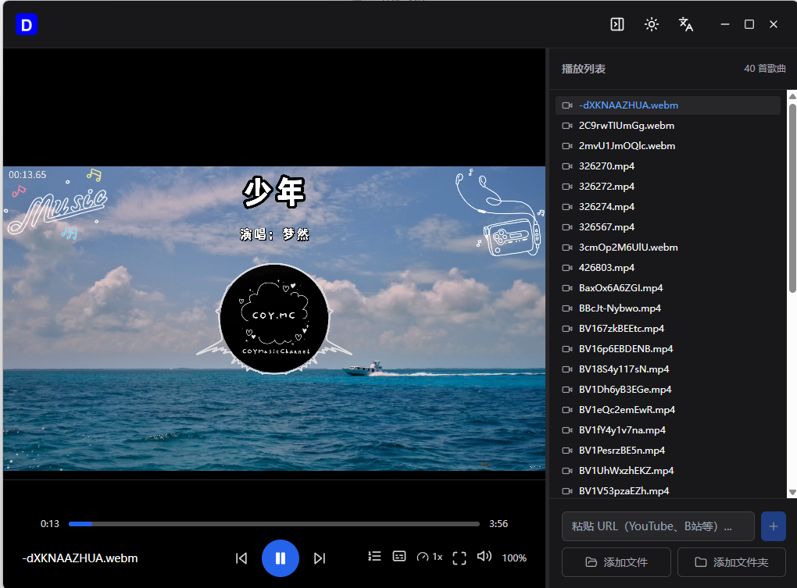
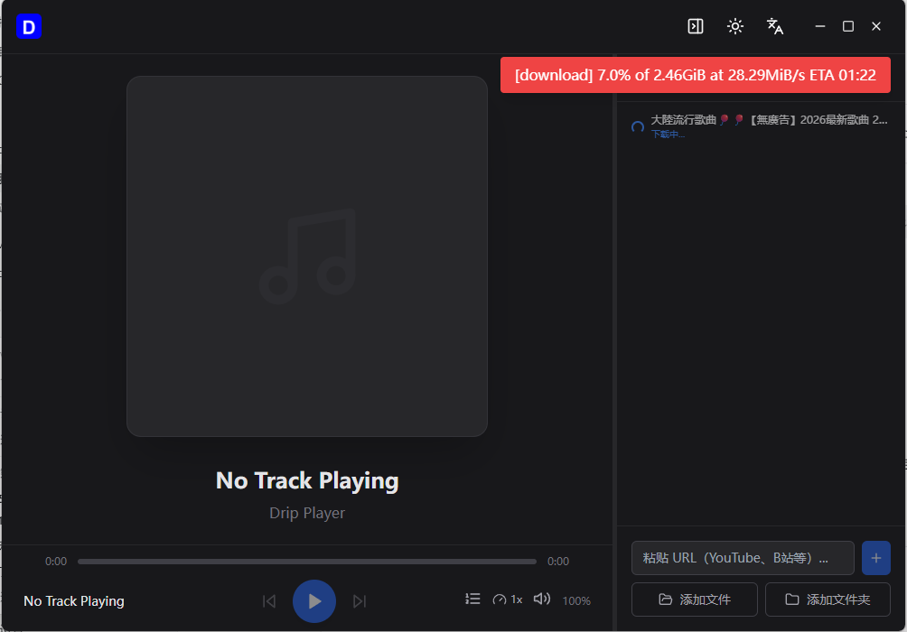

# 影子播放器（Shadow Player）

[English](README.md) | 简体中文

影子播放器是一个基于 Tauri 2、Vue 3 和 Rust 的桌面媒体播放器，面向本地课程视频、音频资料和在线视频链接管理。它支持添加本地文件或文件夹，解析 YouTube、Bilibili 等在线媒体，并通过媒体探测自动选择合适的播放方式。

[](LICENSE)
[](https://tauri.app/)
[](https://vuejs.org/)
[](https://www.rust-lang.org/)





## 功能特性

- 本地媒体库：在“设置 → 通用设置”选择下载保存目录并保存，递归读取该目录及子目录中的音视频；将本地文件放入此目录后点击播放列表刷新按钮。
- 播放列表：保存新目录后整体替换列表并停止旧播放；右上角刷新按钮重新扫描当前目录，同步新增和删除的文件。空目录对应空列表，扫描失败保留原目录和列表，旧文件不移动或删除。
- 探测优先播放：使用 `ffprobe` 读取真实容器和音视频编码，再选择播放引擎。
- 浏览器视频播放：浏览器原生支持的格式通过 `video.js` 播放。
- 自动转封装缓存：对 H.264/AAC 等可兼容浏览器播放的文件执行无损转封装，例如 FLV 容器转 MP4。
- 音频后端：音频通过 Rust 后端和 `rodio` 播放，必要时使用 FFmpeg 处理。
- 外部播放器：浏览器无法播放、也无法转封装的视频，可使用 MPV 播放。
- 下载窗口：点击顶部影子跟读按钮后的下载图标，输入 URL 创建任务；可查看进度、取消和重试，关闭窗口后继续下载。完成后加入当前播放列表，不改变播放内容。
- 下载恢复：任务保存到 SQLite，退出时未完成的任务下次显示“已中断”，手动继续。每次继续使用当前设置目录；切换目录会停止正在运行的下载，旧文件保留原位。
- 影子跟读：导入 SRT/VTT/ASS/SSA 字幕、点句跳转、逐句/AB 复读、遮挡和收藏；本地录音、原声对比及百炼/讯飞模型服务。配置及验证边界见[影子跟读说明](docs/learning-settings.md)。
- 桌面体验：深色模式、自定义标题栏、播放控制、音量、倍速、字幕和侧边栏。
- 页面右键菜单：刷新当前窗口、打开独立设置窗口；播放列表保留曲目移除和清空菜单。
- 通用设置：外观（跟随系统、浅色、深色）、界面语言、关闭主窗口时最小化到托盘，修改后自动保存。
- 设置窗口使用跟随主题的自定义标题栏，支持拖动和独立关闭。
- SQLite 本地存储：下载任务、播放列表、媒体资料与资源关联、外观、界面语言、播放模式和关闭到托盘设置。
- 播放会话：使用引擎实际进度和结束状态，旧下载完成不会覆盖后续播放请求。MPV 由其独立窗口控制。

## 媒体格式策略

影子播放器不再只根据文件后缀决定播放方式。本地文件和缓存文件会先探测：

1. 如果容器和编码属于浏览器原生支持范围，直接用内置视频播放器播放。
2. 如果可以无损转封装成浏览器兼容 MP4，则写入本地 remux 缓存后播放。
3. 如果是纯音频，交给 Rust 音频后端播放。
4. 如果是视频但浏览器链路无法处理，并且随包 `lib/` 中包含 MPV，则使用 MPV 播放。

常见输入格式：

- 音频：`mp3`、`wav`、`ogg`、`flac`、`m4a`、`aac`、`opus`
- 浏览器常见视频：`mp4`、`m4v`、`webm`
- 探测或外部播放器视频：`mkv`、`avi`、`mov`、`flv`、`wmv`、`ts`、`m2ts`、`mpg`、`mpeg`、`3gp`

发布包会携带媒体探测和在线解析所需的工具。

## 环境要求

- Node.js 24 LTS
- pnpm 11.6.0（与 `packageManager` 一致）
- Rust stable toolchain，最低 1.88
- 当前系统对应的 Tauri 2 构建环境
- Windows 用户需要 Microsoft Visual Studio C++ Build Tools

Tailwind 4 的 WebView 要求、TypeScript 6 约束和当前验证结果见[依赖说明](docs/dependency-upgrade.md)。

安装 pnpm：

```bash
npm install -g pnpm@11.6.0
```

## 下载和安装

用户可以在 [GitHub Releases](https://github.com/dripai/drip-player/releases) 下载 Windows 和 macOS 安装包。

应用启动时会检查 GitHub Releases 中的新版本。发现更新后，用户确认即可下载并安装。

## 随包工具

应用只使用随安装包一起分发的 `lib/` 工具目录。开发和构建时，脚本会把当前平台需要的工具下载到项目根目录 `lib/`；打包后，这个目录会随应用一起分发。

Windows 示例：

```text
drip-player/
├── lib/
│   ├── ffmpeg.exe
│   ├── ffprobe.exe
│   ├── ffplay.exe
│   └── yt-dlp.exe
```

推荐工具：

- `ffmpeg` 和 `ffprobe`：媒体探测、时长识别、音频处理、转封装缓存。
- `yt-dlp`：在线视频解析和下载。
- `mpv`：可手动放入 `lib/`，用于播放浏览器无法处理的视频格式。

非 Windows 系统使用不带 `.exe` 的对应可执行文件名。应用只读取随包分发的 `lib/` 工具目录。

## 快速开始

克隆项目：

```bash
git clone git@github.com:dripai/drip-player.git
cd drip-player
```

安装依赖：

```bash
pnpm install --frozen-lockfile
```

开发模式启动桌面应用：

```bash
pnpm tauri dev
```

构建发布包：

```bash
pnpm tauri build
```

前端检查：

```bash
pnpm build
```

Rust 后端检查：

```bash
cd src-tauri
cargo check --locked --all-targets
cargo test --locked --all-targets
```

## 项目结构

```text
drip-player/
├── public/                 # 前端静态资源
├── src/                    # Vue 前端
│   ├── components/          # 播放器、侧边栏、文件树、弹窗等组件
│   ├── store/               # Pinia 播放器状态
│   ├── utils/               # 前端媒体辅助函数
│   ├── App.vue
│   └── main.ts
├── src-tauri/               # Rust/Tauri 后端
│   ├── capabilities/         # Tauri 权限配置
│   ├── icons/                # 应用图标
│   ├── src/
│   │   ├── handlers/         # Tauri 命令处理
│   │   ├── models/           # 媒体、资源、列表、会话、下载、设置
│   │   ├── services/         # 播放、探测、转封装、持久化、在线解析
│   │   └── main.rs
│   └── tauri.conf.json
├── package.json
├── pnpm-lock.yaml
├── README.md
└── README.zh-CN.md
```

## 运行时数据

数据库位于可执行文件旁的 `config/shadow-player.sqlite3`，首次启动使用空播放列表和默认设置。当前结构版本为 2，不迁移旧开发库，不自动删除旧文件。移除播放列表条目保留媒体资料与文件。旧库重新初始化步骤见 [SQLite 存储说明](docs/sqlite-storage.md)，代码职责见 [领域模型与播放流程](docs/domain-model.md)。

以下目录被 Git 忽略：

- `lib/`：构建时下载的随包工具，本地二进制文件不提交到 Git。
- `cache/`：运行时缓存。
- `config/`：SQLite 数据库和运行时配置。
- `downloads/`：下载的媒体文件。
- `doc/`：本地设计文档或私有说明。

转封装缓存会自动清理。应用会按文件年龄和缓存总大小删除旧的 remux 文件。

## 在线媒体说明

在线媒体功能依赖 `yt-dlp`。部分平台或内容可能需要浏览器 Cookie 或登录状态。影子播放器不绕过平台限制，只调用用户本地配置的工具完成解析和下载。

## 贡献

欢迎提交 Issue 和 Pull Request。

提交改动前建议运行：

```bash
pnpm build
cd src-tauri
cargo check --locked --all-targets
cargo test --locked --all-targets
```

## 发布

发布新版本前，需要在 GitHub Actions secrets 中配置 Tauri updater 签名私钥：

- `TAURI_SIGNING_PRIVATE_KEY`：本地生成的 updater 私钥内容。
- `TAURI_SIGNING_PRIVATE_KEY_PASSWORD`：私钥密码。

推送 `v*.*.*` tag 后，GitHub Actions 会构建 Windows 和 macOS 安装包，并生成自动更新所需的签名产物。

## 许可证

本项目基于 [MIT License](LICENSE) 开源。

## 免责声明

影子播放器不提供、托管或分发任何媒体内容。用户需要自行确保本地文件、在线播放和下载行为符合相关法律法规、版权规则以及目标平台的服务条款。
